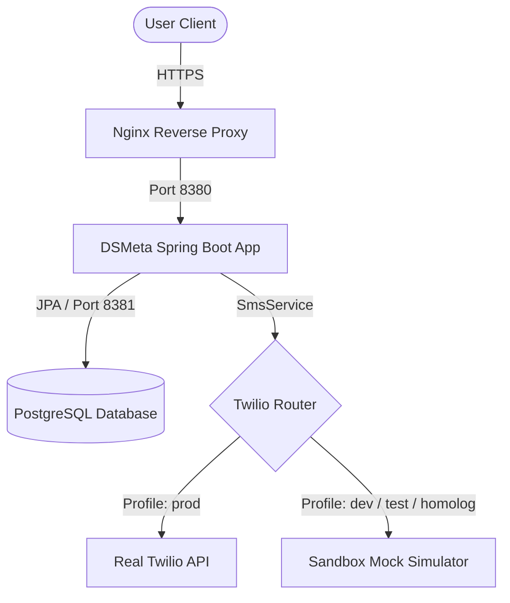

# DSMeta

<div align="center">
  
  
  
  
  
  
  <a href="https://dsmeta-homolog.felipeschirmann.dev.br/swagger-ui.html">
    
  </a>
</div>

<p align="center">
  <b>A premium sales tracking backend ecosystem featuring a Spring Boot REST API. Fully dockerized, security-hardened, and orchestrated with modern CI/CD automation.</b>
</p>

🚀 **DSMeta** is a robust Spring Boot microservice designed to track sales reports and dispatch SMS notifications to highlight top-performing sellers. Developed with clean-code practices, automated test suites, and unified container staging setups.

---

## 📊 Pipeline & Quality Badges

| Build Status | Code Quality | Security Status |
| :--- | :--- | :--- |
| [](https://github.com/felipeschirmann/DSMeta/actions/workflows/ci.yml) | [](https://sonarcloud.io/summary/new_code?id=felipeschirmann_DSMeta) | [](https://sonarcloud.io/summary/new_code?id=felipeschirmann_DSMeta) |
| [](https://github.com/felipeschirmann/DSMeta/actions/workflows/cd.yml) | [](https://sonarcloud.io/summary/new_code?id=felipeschirmann_DSMeta) | [](https://sonarcloud.io/summary/new_code?id=felipeschirmann_DSMeta) |

---

## 🏛️ Architecture & System Topology

The system uses a modern reverse-proxy architecture to route traffic to the containerized Spring Boot backend, which dynamically switches between Twilio's production API and a secure Sandbox simulator depending on the active environment profile.



---

## 🌟 Key Features

* **Dynamic Sales Querying**: Retrieve and filter sales reports by date range, ordered by high-value deals with pageable JSON payloads.
* **Twilio SMS Notification**: Send SMS alerts to acknowledge outstanding sales performance.
* **Sandbox Mock Protection**: Automatic detection of development and test environments to simulate Twilio SMS dispatch, safeguarding against unnecessary costs or leaked API calls in public pipelines.
* **Swagger API Documentation**: Automated API endpoint documentation exposed interactively.
* **Code Coverage Analysis**: Injected JaCoCo reporting validating test suites integrity.

---

## 🖥️ VM Staging & Port Coexistence Strategy

To ensure seamless coexistence with other projects (e.g., DSMovie, DSVendas, BDS06) on the same staging server, the DSMeta container stack is mapped using unique host ports:

| Container Name | Staging Domain / Routing | VM Host Port | Container Port | Purpose |
| :--- | :--- | :--- | :--- | :--- |
| **dsmeta-app** | `dsmeta-homolog.felipeschirmann.dev.br` | `8380` | `8080` | Spring Boot Application |
| **dsmeta-postgres** | *Internal connection* | `8381` | `5432` | PostgreSQL Database |

---

## ⚙️ IntelliJ Run Configurations Integration

The workspace includes pre-configured IntelliJ IDEA XML targets. Access them directly inside your IDE interface under the virtual folders:

### 📁 Folder: `[Test]`
* **`[Test] Run Application (H2)`**: Launches the application locally in development mode utilizing an in-memory H2 database.
* **`[Test] Verify Coverage (Maven)`**: Runs Maven verify and generates localized JaCoCo coverage reports.
* **`[Test] View Coverage Report`**: Automatically builds JaCoCo reports and opens them directly in Google Chrome.
* **`[Test] View Swagger UI`**: Starts the backend and opens the Swagger UI landing page.
* **`[Test] Run Full Suite`**: Sequence runner which compiles, runs JUnit tests, collects coverage, launches the app, and opens Swagger documentation.
* **`[Test] Stop Application`**: Instantly terminates any running Spring Boot process listening on local port `8080`.

### 📁 Folder: `[Dev]`
* **`docker-compose-dev.yml: Compose Deployment`**: Runs the entire development stack (App + Postgres) inside Docker containers with a clean, ephemeral state.

---

## 🐳 Running the Application

### Method 1: Local Development (IDE or CLI)
1. Ensure Java 17 and Maven are installed.
2. Boot the project using the IDE Run Button or run:
   ```bash
   mvn -f backend/pom.xml spring-boot:run
   ```
3. Access the Swagger documentation at: `http://localhost:8080/swagger-ui.html`

### Method 2: Docker Containers (Local Dev Stack)
1. Build the local development containers:
   ```bash
   docker compose -f docker-compose-dev.yml up --build -d
   ```
2. The application will boot on port `8080` with a containerized PostgreSQL database.

---

## 🚀 CI/CD Automation Flow

### Continuous Integration (CI) - `ci.yml`
Triggered on every push or pull request to the `main` branch.
1. Sets up JDK 17 (Temurin distribution) and caches Maven dependencies.
2. Compiles the backend and executes the JUnit test suite (`mvn verify`).
3. Connects to **SonarCloud** to execute deep static analysis, reporting on code smells, vulnerabilities, security hotspots, and code coverage.

### Continuous Deployment (CD) - `cd.yml`
Triggered automatically on successful completion of the CI workflow.
1. Compiles and packages the Spring Boot application into a `.war` archive.
2. Builds a multi-platform Docker Image (`linux/amd64` and `linux/arm64`) using the production Dockerfile.
3. Publishes the image to **Docker Hub** tagged with `latest` and the unique short commit SHA.
4. Transfers the Nginx configuration via **SCP** to the remote Cloud VM.
5. Connects via **SSH** to the staging VM to:
   * Write/update `docker-compose-homolog.yml`.
   * Update env files and pull the newly built Docker image.
   * Stop previous containers and deploy the updated application stack.
   * Verify Nginx syntax and reload the proxy server.
